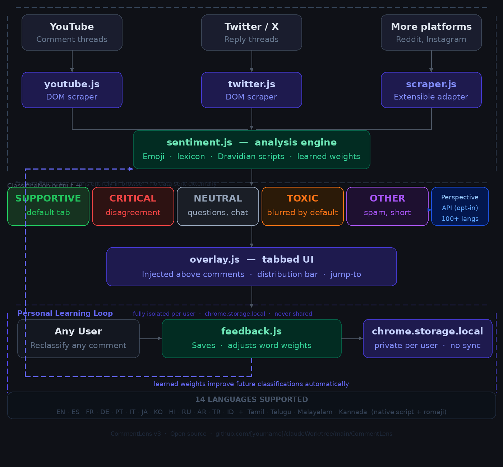
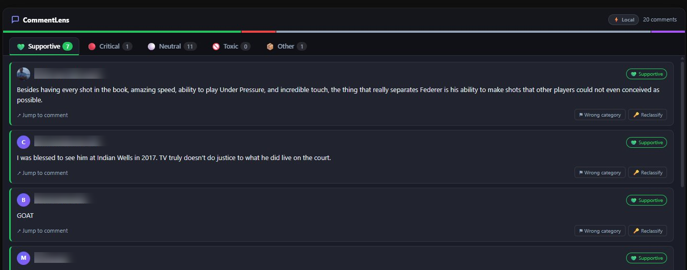
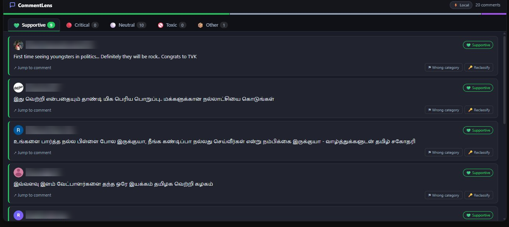

# 💬 CommentLens — Sentiment Tabs for YouTube & Twitter/X

> **Turn comment sections from noise into signal.**
> CommentLens automatically categorizes every comment by sentiment and presents them in clean, navigable tabs — entirely in your browser. No data ever leaves your device.



---

## ✨ What it does

Instead of scrolling through a flat wall of comments, CommentLens overlays a tabbed UI above the native comment section:

| Tab | What's in it |
|-----|-------------|
| 💚 **Supportive** | Praise, agreement, encouragement — shown by default |
| 🔴 **Critical** | Disagreement, counterpoints, opposition |
| ⚪ **Neutral** | Questions, observations, general chat |
| 🚫 **Toxic** | Vulgar or hateful language — blurred until you choose to reveal |
| 📦 **Other** | Spam, very short or unclassifiable comments |

A color-coded distribution bar at the top shows the sentiment breakdown at a glance.

---

## 🌍 Language support

Works across **14 languages** with full sentiment detection:

| Language group | Languages |
|---------------|-----------|
| European | English, Spanish, French, German, Portuguese, Italian |
| Asian | Japanese, Korean, Hindi, Russian, Arabic, Turkish, Indonesian |
| Dravidian | **Tamil, Telugu, Malayalam, Kannada** — native script + romanised input |

Dravidian languages are detected by Unicode script range (Tamil: U+0B80–0BFF, Telugu: U+0C00–0C7F, Malayalam: U+0D00–0D7F, Kannada: U+0C80–0CFF) and scored against native-script lexicons. Romanised versions (e.g. "arumai", "bagunna", "adipoli") are handled separately.

---

## 🧠 How the sentiment engine works

Everything runs **locally in your browser** — no API calls required (though an optional Perspective API key unlocks enhanced multilingual toxicity detection).

The engine uses three layers:

1. **Emoji valence** — universal, language-agnostic. 👍😍🔥 → supportive. 👎😡🤮 → critical.
2. **Multilingual lexicon** — ~300 positive and negative terms across all 14 languages, with negation handling ("not amazing" → critical, "not bad" → supportive).
3. **Toxic pattern matching** — regex patterns that only match explicit slurs, threats, and sexual vulgarity. Strong criticism ("this is terrible", "completely wrong") is **never** flagged as toxic.

### Personal learning loop

When the engine misclassifies a comment, you can click **✏️ Reclassify** and select the correct category. This correction:

- Is saved permanently to `chrome.storage.local`
- Adjusts the weight of words in that comment for future classifications
- Is **completely private** — stored only in your browser, never synced, never shared

Every user builds their own independent model. Your corrections improve only your own experience.

---

## 🔒 Privacy

- ✅ Zero network requests for analysis
- ✅ No comment data stored on any server
- ✅ No user tracking or telemetry
- ✅ All learning data stays in `chrome.storage.local` — your browser, your device
- ✅ Permissions: `activeTab` and `storage` only

---

## 📦 Installation

### Option A — Load unpacked (developer mode)

1. **Download** this repository as a ZIP → click **Code → Download ZIP** above
2. **Unzip** the folder
3. Open Chrome and go to: `chrome://extensions`
4. Enable **Developer mode** (toggle in the top-right corner)
5. Click **Load unpacked** and select the `CommentLens` folder
6. The CommentLens icon (💬) appears in your Chrome toolbar

### Option B — Clone

```bash
git clone https://github.com/[yourname]/claudeWork.git
cd claudeWork/CommentLens
```
Then follow steps 3–6 above.

---

## 🚀 How to use

### YouTube
1. Go to any YouTube video: `youtube.com/watch?v=...`
2. Scroll down to load the comments section
3. Wait ~2–3 seconds
4. CommentLens appears **above** the native comments with 5 sentiment tabs

### Twitter / X
1. Click any tweet to open its detail page (must be a single tweet view with replies)
2. Wait ~2 seconds for replies to load
3. CommentLens appears **above** the replies

### Reclassifying a comment
1. Click **✏️ Reclassify** on any comment card
2. Pick the correct category from the picker
3. The correction is saved instantly — the card updates and the engine learns

### Settings & stats
- Right-click the CommentLens toolbar icon → **Options**
- Or go to `chrome://extensions` → CommentLens → **Extension options**
- View how many corrections you've made, how many words the engine has learned, and reset if needed

---

## 🏗️ Architecture

```
CommentLens/
├── manifest.json          # Chrome Extension Manifest V3
├── popup.html             # Toolbar popup
├── settings.html          # Options page — correction stats & reset
├── icons/                 # Extension icons
└── src/
    ├── sentiment.js       # Analysis engine (local lexicon + optional Perspective API)
    ├── feedback.js        # Personal learning system (chrome.storage.local)
    ├── overlay.js         # Tabbed UI injector
    ├── overlay.css        # Dark-mode overlay styles
    ├── youtube.js         # YouTube DOM scraper + SPA navigation watcher
    └── twitter.js         # Twitter/X DOM scraper + SPA navigation watcher
```

### Optional: Perspective API

For enhanced toxicity detection in non-English languages, you can add a free [Perspective API key](https://developers.perspectiveapi.com/s/docs-get-started):

1. Get a free key from Google
2. Open `src/sentiment.js`
3. Paste your key on line 1: `const PERSPECTIVE_KEY = "your-key-here";`

Without a key, the extension works fully using the local engine.

---

## 🛣️ Roadmap

- [ ] Reddit support
- [ ] Instagram support
- [ ] Adjustable sensitivity slider per category
- [ ] Export comments by category as CSV
- [ ] Highlight mode — color-code comments in-place instead of tabs
- [ ] Stats view per video / post

---

## 🐛 Troubleshooting

**Comments not appearing?**
- Make sure you've scrolled down to load comments first
- YouTube lazy-loads comments — wait 3–4 seconds after scrolling
- Refresh the page if the overlay doesn't appear

**Twitter/X not working?**
- CommentLens only runs on single tweet pages (replies view), not the main timeline
- Make sure you clicked through to a specific tweet

**Wrong category for a comment?**
- Click ✏️ Reclassify and correct it — the engine will learn from your feedback
- Sarcasm and irony can sometimes fool the lexicon-based classifier; the Perspective API handles these better

---

## 📸 Screenshots

*English comments (YouTube)*


*Tamil comments — native script (YouTube)*


*Twitter/X replies (SpaceX tweet)*


---

## 🤝 Part of claudeWork

This extension is part of [claudeWork](https://github.com/[yourname]/claudeWork) — a collection of tools and ideas built using Claude.

---

*Built with Claude · CommentLens v3 · MIT License*
